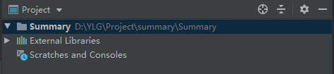
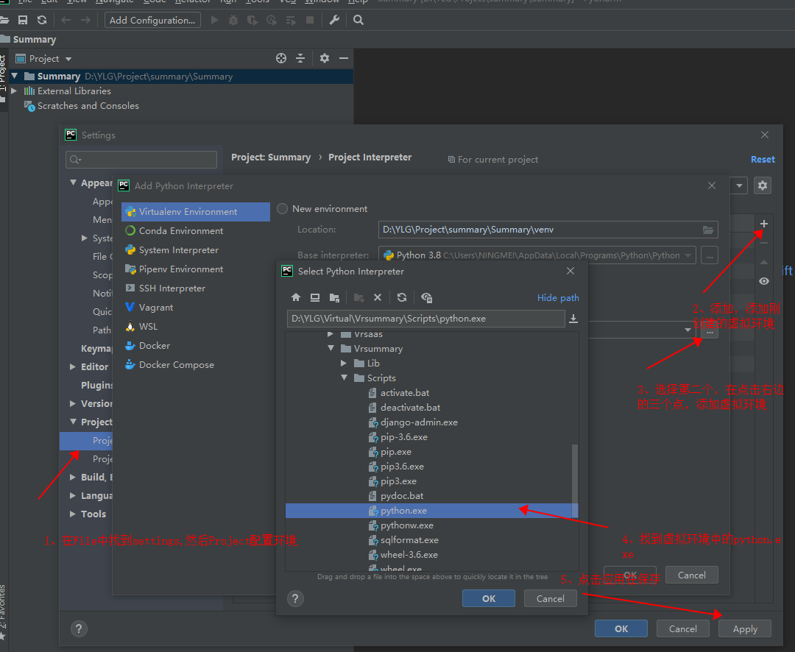
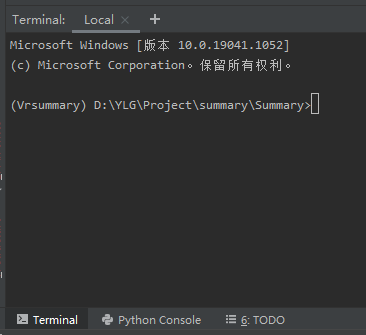
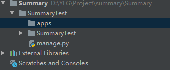

## 项目搭建快速使用

!!如果放到git的话的看美多的笔记

公司开发的话看

```
https://gitee.com/yyzlt/meiduo/blob/master/A.%E8%B5%84%E6%96%99/A.%E7%AC%94%E8%AE%B0/01%E5%87%86%E5%A4%87%E7%8E%AF%E5%A2%83.md#11-giett%E4%B8%8A%E5%88%9B%E5%BB%BA%E4%BB%93%E5%BA%93meiduo
```

### 1、新建项目

在文件夹中新增一个文件夹Summary，用pycharm打开这个文件夹



### 2、虚拟环境 virtualenv

#### 2.1安装

```
pip install virtualenv
```

#### 2.2创建虚拟环境

```
virtualenv 环境名称

# 注意：执行命令了会创建[环境名称]文件夹，放置所有的环境，进入指定目录 D（你想放的位置）
假设：目前电脑有python2.7/python3.6
virtualenv 环境名称 --python=python3.6    指定版本
virtualenv 环境名称 --python=“c:\python\python3.6.exe” 或者
1. 打开终端
2. 安装：virtualenv
	pip3 install virtualenv
3. 关闭终端，再重新打开
4. 通过命令进入指定目录（自己想放的位置）
	win:
		>>> D:
		>>> cd envs
5. 创建虚拟环境
	virtualenv s28
```

#### 2.3激活、退出 虚拟环境

```
激活:

win:
	>>> cd Scripts 进入虚拟环境 Scripts 目录
	>>> activate 激活虚拟环境
	(text) G:\Python代码\Python__all__virtualenv\text\Scripts>
mac:
	>>> source s28/bin/activate
	(s25) >>>
退出:

win:
	>>> cd Scripts 进入虚拟环境 Scripts 目录
	>>> deactivate 退出虚拟环境
	G:\Python代码\Python__all__virtualenv\text\Scripts>
mac:
	>>>  任意目录 deactivate命令退出
```

Windows下创建不同版本的python虚拟环境

[https://blog.csdn.net/rongDang/article/details/85338433](https://gitee.com/link?target=https%3A%2F%2Fblog.csdn.net%2FrongDang%2Farticle%2Fdetails%2F85338433)

```
virtualenv -p C:\Users\NINGMEI\AppData\Local\Programs\Python\Python37\python.exe Vrcoupon
```

#### 2.4配置虚拟环境



出来这个就表示成功了




#### 2.5下载第三方

```
pip install django  # django
```

```
pip install djangorestframework  # drf框架
```


### 3、创建django项目

```
django-admin startproject 项目名
```


```
# 在settings里面添加,注册DRF

INSTALLED_APPS = [
    'rest_framework',  # DRF
]
```


### 4、创建APP

1.先在项目名的同级创建一个apps文件夹，用来专门存放APP



2.cd apps 进入这个文件夹创建APP

```
python manage.py startapp APP名称

manage.py在上一层的话就../ 上上层 ../../
python ../../manage.py startapp APP名称
```

3.因为我们在app什么添加了一层文件夹，所以要在settings中添加导包路径

settings.py

```python
BASE_DIR = os.path.dirname(os.path.dirname(os.path.abspath(__file__)))  # 查看所有的导包路径


import sys
sys.path.insert(0, os.path.join(BASE_DIR, 'apps'))
```

4.在settings.py中配置APP

```python
INSTALLED_APPS = [
    'django.contrib.admin',
    'django.contrib.auth',
    'django.contrib.contenttypes',
    'django.contrib.sessions',
    'django.contrib.messages',
    'django.contrib.staticfiles',

    'rest_framework',  # DRF
    'app01.apps.App01Config'
]
```


### 5、路由配置

在新建的app下创建一个urls.py（子路由）

```python
from django.conf.urls import url

from . import views

urlpatterns = [
    url(r'^test/$', views.TextView.as_view()), 
]

```

```python
from rest_framework.response import Response
from rest_framework.views import APIView


class TextView(APIView):
    def get(self, request, *args, **kwargs):
        print("11111111111111111")
        return Response("f")
```

在根目录下的urls.py写入

```
from django.contrib import admin
from django.urls import path, include

urlpatterns = [
    path('admin/', admin.site.urls),
    path('api/app01/', include('app01.urls')), # 新建的app
]
```

测试：http://127.0.0.1:8000/api/app01/test/


6、更多配置的话看美多的笔记

```python
https://gitee.com/yyzlt/meiduo/blob/master/A.%E8%B5%84%E6%96%99/A.%E7%AC%94%E8%AE%B0/01%E5%87%86%E5%A4%87%E7%8E%AF%E5%A2%83.md#43-mysql%E6%95%B0%E6%8D%AE%E5%BA%93%E9%85%8D%E7%BD%AE%E5%8F%8A%E9%A9%B1%E5%8A%A8%E9%85%8D%E7%BD%AE
```

