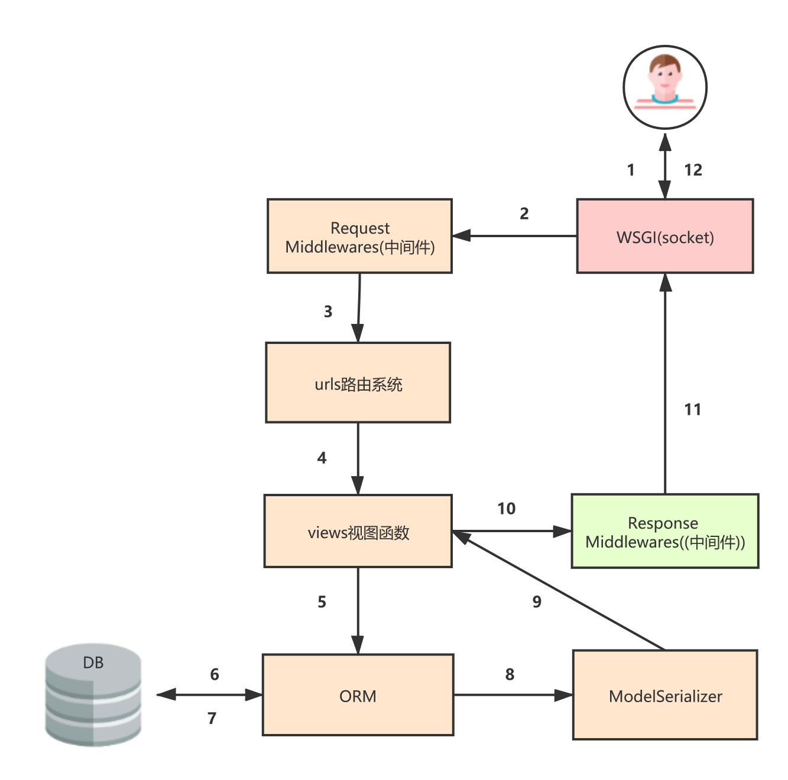

# Serizlizer序列化器


## 一、序列化器的作用：

1. **进行数据的校验**
2. **对数据对象进行转换**
3. 序列化生产JSON数据、反序列化生产模型对象

```
Django REST framework中的Serializer使用类来定义，须继承自rest_framework.serializers.Serializer。
```


## 二、普通序列化-Serializer和ModelSerializer

```
serializers.Serializer 是最普通的序列化类，在序列化类中，每一个字段都需要自己定义，而且序列化类中定义的字段名必须跟model中的一致。
```

### 2.1 定义序列化

例如我们有以下模型类：

```python
from django.db import models


class UserGroup(models.Model):  # 分类
    title = models.CharField(max_length=128)


class UserInfo(models.Model):  # 用户消息
    user_type_choices = ((1, '普通用户'), (2, '管理员'))
    username = models.CharField(max_length=32, unique=True)
    password = models.CharField(max_length=32)
    user_type = models.IntegerField(choices=user_type_choices)

    group = models.ForeignKey(to='UserGroup', on_delete=models.CASCADE)
    role = models.ManyToManyField(to='Role')


class UserToken(models.Model): # 用户登录的token
    user = models.OneToOneField(to='UserInfo', on_delete=models.CASCADE)
    token = models.CharField(max_length=128)


class Role(models.Model):  # 角色
    title = models.CharField(max_length=128)
```

我们想为这个模型类提供一个序列化器，可以定义如下

#### Serializer(示例)

具体在下面

- 如果用Serializer的话模型类的每个字段都需要定义，字段名也要一样

- 我们可以用**source='get_user_type_display'**来输出选择框中的value

- 用**source='group.title'**输出一对多字段中的内容

- 可以在序列化中重写方法

- 自定义字段serializers.SerializerMethodField()

  - 1、先自定义一个字段    roles = serializers.SerializerMethodField()  

  - 2、用get_字段名的方式重写自定义的字段

    - ```
          def get_roles(self, value):  # 给自定义字段重写方法(这样就可以输出多对多里面的内容了)
              role_obj_list = value.role.all()  # 获取当前对象role字段所有的内容
              ret = []
              for item in role_obj_list:
                  ret.append({'id': item.id, 'title': item.title})
              return ret
      ```

```python
# 1、Serializer
class UserInfoSerializer(serializers.Serializer):
    """获取用户表的使用信息"""
    id = serializers.IntegerField()  # 如果这个对应模型类字段的话，username名字一定要和定义模型类字段名一样
    username = serializers.CharField()
    password = serializers.CharField()

    # user_type = serializers.CharField()  # 这样只会输出id (1, '普通用户') 我们想输出普通用户就要换种方法
    # 加source了就可以随便命名，就不用上上面字段一样必须写正确(source指定数据库的字段)
    new_user_type = serializers.CharField(source='get_user_type_display')  # 我们这里光user_type是不行的，(choices)

    # group = serializers.CharField()  # 一对多字段，获取到的是对象
    new_group = serializers.CharField(source='group.title')  # 一对多字段，这样就可以获取到里面的内容，我们不用加()，内置帮我们加了

    # rls = serializers.CharField(source='role.all')  # 多对多，这样只能获取到对象(不能直接的像一对多一样)
    roles = serializers.SerializerMethodField()  # 自定义字段显示

    def get_roles(self, value):  # 给自定义字段重写方法(这样就可以输出多对多里面的内容了)
        role_obj_list = value.role.all()  # 获取当前对象role字段所有的内容
        ret = []
        for item in role_obj_list:
            ret.append({'id': item.id, 'title': item.title})
        return ret
    
    def create(self, validated_data):   #validated_data表示传递过来的数据
        return UserInfo.objects.create(**validated_data)  #保存数据
 
    def update(self, instance, validated_data):  #instance：传递过来的实例，就是 model实例，validated_data传递过来的数据，
        instance.title = validated_data.get('username', instance.username)  #instance:表示UserInfo实例，validated_data传递过来的数据
        instance.vum = validated_data.get('password', instance.password) #get('vum', instance.vum)：表示没有取到就用原来的值
        instance.save()
        return instance
```


#### ModelSerializer(示例)

- 模型序列化(ModelSerializer)简介
- 模型序列化应用post和get(获取所有表数据)
- 模型序列化应用put(全部参数更新)、get(根据id获取表单条数据)、delete方法、patch(部分参数更新)
- ModelSerializers默认帮我们实现了创建和更新方法

```python
class MyField(serializers.CharField):
    """自定义字段"""

    def to_representation(self, value):
        print(value)
        return "你好：" + value + "：美女"


# 2、ModelSerializer
class UserInfoSerializer02(serializers.ModelSerializer):
    """获取用户表的使用信息"""
    new_user_type = serializers.CharField(source='get_user_type_display')
    new_group = serializers.CharField(source='group.title')
    roles = serializers.SerializerMethodField()
    ooo_name = MyField(source='get_user_type_display')  # 自定义字段

    class Meta:
        model = UserInfo
        #fields、exclude、fields 三者只能取一
        fields = ['id', 'username', 'password', 'new_user_type', 'roles', 'new_group', 'ooo_name']
       	#exclude = () 表示不返回字段     
       	#fields = '__all__': 表示所有字段(表示模型有什么字段，我们就显示什么字段)
 
       #read_only_fields = () #设置只读字段 不接受用户修改
    
    def get_roles(self, value):  # 给自定义字段重写方法(这样就可以输出多对多里面的内容了)
        role_obj_list = value.role.all()  # 获取当前对象role字段所有的内容
        ret = []
        for item in role_obj_list:
            ret.append({'id': item.id, 'title': item.title})
        return ret
```

请求原理



#### 注意

```python
username = serializers.CharField()  # 如果这个对应模型类字段的话，username名字一定要和定义模型类字段名一样

source:指定那个模型类字段
	choies: ('1':'普通用户')一般获取只能得到id ，source='get_user_type_display' 。所以要 get_模型类字段名_display,可以获取到 普通用户
		new_user_type = serializers.CharField(source='get_user_type_display')
		
	一对多字段
		source='group':获取到的是对象，所以我们可以直接点. 由于内部帮我们加了括号所以我们不用加括号
    	new_group = serializers.CharField(source='group.title')  # 一对多字段，这样就可以获取到里面的内容，我们不用加()，内置帮我们加了
    
    多对多字段
        roles = serializers.SerializerMethodField()  # 自定义字段显示

        def get_roles(self, value):  # 给自定义字段重写方法(这样就可以输出多对多里面的内容了)
            role_obj_list = value.role.all()  # 获取当前对象role字段所有的内容
            ret = []
            for item in role_obj_list:
                ret.append({'id': item.id, 'title': item.title})
            return ret
自定义字段
	class MyField(serializers.CharField):
    """自定义字段"""

    def to_representation(self, value):
        print(value)  # 获取的值
        return "你好：" + value + "：美女"
```

**注意：serializer不是只能为数据库模型类定义，也可以为非数据库模型类的数据定义。**serializer是独立于数据库之外的存在。

#### 小结

- 当请求方法为PATCH 序列化需要加 partial=True 让支持增量更新
- 返回JSON 数据的 content_type 一定是 application/json
- 路由里面的参数跟视图里面的参数一定要一样，因为是关键字传参

### 2.2 字段与选项

**常用字段类型**：

| 字段                    | 字段构造方式                                                 |
| ----------------------- | ------------------------------------------------------------ |
| **BooleanField**        | BooleanField()                                               |
| **NullBooleanField**    | NullBooleanField()                                           |
| **CharField**           | CharField(max_length=None, min_length=None, allow_blank=False, trim_whitespace=True) |
| **EmailField**          | EmailField(max_length=None, min_length=None, allow_blank=False) |
| **RegexField**          | RegexField(regex, max_length=None, min_length=None, allow_blank=False) |
| **SlugField**           | SlugField(max*length=50, min_length=None, allow_blank=False) 正则字段，验证正则模式 [a-zA-Z0-9*-]+ |
| **URLField**            | URLField(max_length=200, min_length=None, allow_blank=False) |
| **UUIDField**           | UUIDField(format='hex_verbose') format: 1) `'hex_verbose'` 如`"5ce0e9a5-5ffa-654b-cee0-1238041fb31a"` 2） `'hex'` 如 `"5ce0e9a55ffa654bcee01238041fb31a"` 3）`'int'` - 如: `"123456789012312313134124512351145145114"` 4）`'urn'` 如: `"urn:uuid:5ce0e9a5-5ffa-654b-cee0-1238041fb31a"` |
| **IPAddressField**      | IPAddressField(protocol='both', unpack_ipv4=False, **options) |
| **IntegerField**        | IntegerField(max_value=None, min_value=None)                 |
| **FloatField**          | FloatField(max_value=None, min_value=None)                   |
| **DecimalField**        | DecimalField(max_digits, decimal_places, coerce_to_string=None, max_value=None, min_value=None) max_digits: 最多位数 decimal_palces: 小数点位置 |
| **DateTimeField**       | DateTimeField(format=api_settings.DATETIME_FORMAT, input_formats=None) |
| **DateField**           | DateField(format=api_settings.DATE_FORMAT, input_formats=None) |
| **TimeField**           | TimeField(format=api_settings.TIME_FORMAT, input_formats=None) |
| **DurationField**       | DurationField()                                              |
| **ChoiceField**         | ChoiceField(choices) choices与Django的用法相同               |
| **MultipleChoiceField** | MultipleChoiceField(choices)                                 |
| **FileField**           | FileField(max_length=None, allow_empty_file=False, use_url=UPLOADED_FILES_USE_URL) |
| **ImageField**          | ImageField(max_length=None, allow_empty_file=False, use_url=UPLOADED_FILES_USE_URL) |
| **ListField**           | ListField(child=, min_length=None, max_length=None)          |
| **DictField**           | DictField(child=)                                            |

**选项参数：**

| 参数名称            | 作用             |
| ------------------- | ---------------- |
| **max_length**      | 最大长度         |
| **min_lenght**      | 最小长度         |
| **allow_blank**     | 是否允许为空     |
| **trim_whitespace** | 是否截断空白字符 |
| **max_value**       | 最大值           |
| **min_value**       | 最小值           |

#### 通用参数：

| 参数名称           | 说明                                          |
| ------------------ | --------------------------------------------- |
| **read_only**      | 表明该字段仅用于序列化输出，默认False         |
| **write_only**     | 表明该字段仅用于反序列化输入，默认False       |
| **required**       | 表明该字段在反序列化时必须输入，默认True      |
| **default**        | 反序列化时使用的默认值                        |
| **allow_null**     | 表明该字段是否允许传入None，默认False         |
| **validators**     | 该字段使用的验证器                            |
| **error_messages** | 包含错误编号与错误信息的字典                  |
| **label**          | 用于HTML展示API页面时，显示的字段名称         |
| **help_text**      | 用于HTML展示API页面时，显示的字段帮助提示信息 |

#### **参数约束**

```python
read_only：True表示不允许用户自己上传，只能用于api的输出。
 
write_only: 与read_only对应，表示只能传递过来，不能自动生成
 
required: 顾名思义，就是这个字段是否必填。
 
allow_null/allow_blank：是否允许为NULL/空 。
 
error_messages：出错时，信息提示。
name = serializers.CharField(required=True, min_length=6,
                error_messages={
                    'min_length': '名字不能小于6个字符',
                    'required': '请填写名字'})
 
label: 字段显示设置，如 label=’验证码’
 
help_text: 在指定字段增加一些提示文字，这两个字段作用于api页面比较有用
 
style: 说明字段的类型，这样看可能比较抽象，看下面例子：
# 在api页面，输入密码就会以*显示
password = serializers.CharField(
    style={'input_type': 'password'})
# 会显示选项框
color_channel = serializers.ChoiceField(
    choices=['red', 'green', 'blue'],
    style={'base_template': 'radio.html'})
 
validators:自定义验证逻辑
```


### 2.3 增删改查示例

models.py

```python
from django.db import models

class User(models.Model):
    """用户"""
    username = models.CharField(max_length=128, verbose_name="用户账号")
    password = models.CharField(max_length=128, verbose_name="用户密码")
```

urls.py

```python
from django.conf.urls import url

from . import views

urlpatterns = [
    url(r'^user/$', views.UserView.as_view()),  # 查看所有用户
    url(r'^user/(?P<pk>\d+)/$', views.UserView.as_view()),  # 查看所有用户
]
```

views.py

```python
from rest_framework import exceptions, serializers
from rest_framework.response import Response
from rest_framework.serializers import Serializer, ModelSerializer
from rest_framework.views import APIView

from .models import User


class UserSerializer(ModelSerializer):  # ModelSerializer
    class Meta:
        model = User
        fields = "__all__"


class UserSerializer2(Serializer):  # Serializer
    username = serializers.CharField()
    password = serializers.CharField()

    def create(self, validated_data):  # validated_data表示传递过来的数据
        return User.objects.create(**validated_data)  # 保存数据

    def update(self, instance, validated_data):  # instance：传递过来的实例，就是 model实例，validated_data传递过来的数据，
        # instance.content = validated_data.get('content', instance.content)
        instance.save()
        return instance


class UserView(APIView):

    def get(self, request, *args, **kwargs):
        # http://127.0.0.1:8000/api/app01/user/ 请求方法get
        user_obj = User.objects.all()
        serializer = UserSerializer(data=user_obj, many=True)
        serializer.is_valid()
        return Response(serializer.data)

    def post(self, request, *args, **kwargs):
        # http://127.0.0.1:8000/api/app01/user/ 请求方法post
        data = request.data
        serializer = UserSerializer2(data=data)
        serializer.is_valid(raise_exception=True)
        serializer.save()
        return Response({"code": 0, "message": "success", "data": data})

    def delete(self, request, pk, *args, **kwargs):
        # http://127.0.0.1:8000/api/app01/user/1/ 请求方法delete
        try:
            result = User.objects.get(pk=pk)
        except:
            raise exceptions.ValidationError("删除对象不存在")

        result.delete()
        return Response({"code": 0, "message": "success", "data": "删除成功"})

    def put(self, request, pk, *args, **kwargs):
        # http://127.0.0.1:8000/api/app01/user/1/ 请求方法put
        try:
            result = User.objects.get(pk=pk)
        except:
            raise exceptions.ValidationError("修改对象不存在")
        data = request.data
        serializer = UserSerializer(data=data, instance=result, partial=False)  # 全部更新
        serializer.is_valid(raise_exception=True)
        serializer.save()
        return Response({"code": 0, "message": "success", "data": data})

    def patch(self, request, pk, *args, **kwargs):
        # http://127.0.0.1:8000/api/app01/user/1/ 请求方法patch
        try:
            result = User.objects.get(pk=pk)
        except:
            raise exceptions.ValidationError("修改对象不存在")
        data = request.data
        serializer = UserSerializer(data=data, instance=result, partial=True)  # 部分更新
        serializer.is_valid(raise_exception=True)
        serializer.save()
        return Response({"code": 0, "message": "success", "data": data})
```


## 三 使用序列化器

定义好Serializer类后，就可以创建Serializer对象了。

Serializer的构造方法为：

```
Serializer(instance=None, data=empty, **kwarg)
```

说明：

1）用于序列化输出时，将模型类对象传入**instance**参数

2）用于反序列化输入时，将要被反序列化的数据传入**data**参数

3）除了instance和data参数外，在构造Serializer对象时，还可通过**context**参数额外添加数据，如

```
serializer = AccountSerializer(account, context={'request': request})
```

**通过context参数附加的数据，可以通过Serializer对象的context属性获取。（可以在序列化中额外的接受参数）**

### 两点说明：

1） 在对序列化器进行save()保存时，可以额外传递数据，这些数据可以在create()和update()中的validated_data参数获取到

```python
serializer.save(owner=request.user)
```

2）默认序列化器必须传递所有required的字段，否则会抛出验证异常。但是我们可以使用partial参数来允许部分字段更新

```python
# Update `comment` with partial data
serializer = CommentSerializer(comment, data={'content': u'foo bar'}, partial=True)
```


### 3.1 自动序列化连表（depth）

depth：这个字段可以用来深度遍历。就是继续往下找，官网上最多深度遍历10层，但是一般建议 2-3层，但是只是叠加数据返回量。

```python
# 3、深度depth = {0-10}层
class UserInfoSerializer03(serializers.ModelSerializer):
    new_user_type = serializers.CharField(source='get_user_type_display')

    class Meta:
        model = UserInfo
        fields = ['id', 'username', 'password', 'new_user_type', 'role', 'group']
        depth = 1  # 0~10   管理的所有模型  (choices,还是要自己加)
        
        
class UserInfoView(APIView):
    """获取所有的用户信息"""

    def get(self, request, *args, **kwargs):
        userinfo = models.UserInfo.objects.all()
        userinfo = UserInfoSerializer03(userinfo, many=True)
        ret = json.dumps(userinfo.data, ensure_ascii=False)
        return HttpResponse(ret)
        
url(r'^(?P<version>[v1|v2]+)/userinfo/$', views.UserInfoView.as_view()),  # 序列化操作 获取所有用户信息
```


### 3.2 生成链接（序列化输出内容）

**HyperlinkedIdentityField** :字段名是模型类的字段名

```python
# url.py 

url(r'^(?P<version>[v1|v2]+)/userinfo/$', views.UserInfoView.as_view()),  # 序列化操作 获取所有用户信息

# http://127.0.0.1:8000/api/v1/group/2
# 序列化操作 生产一个url连接这个是获取分组信息
url(r'^(?P<version>[v1|v2]+)/group/(?P<pk>\d+)$', views.GroupView.as_view(), name='gp'),
# 4、把分组字段生成一条url,并显示（生成链接）
class UserInfoSerializer04(serializers.ModelSerializer):
    """
    HyperlinkedIdentityField
        view_name：对应url路由中的name参数  (name='gp')
        !!! lookup_field:设置url后面这个pk以那个模型类拼接成url，
            默认是当前模型类的id（但是这样的话显然数据不对，因为我们是用另外一张表的UserGroup），
            所有要重新用这个lookup_field重新指定以那个表的主键生成url。
        lookup_url_kwarg：对应的是定义的url路由 roup/(?P<pk>\d+）
        
	context
    ！！！ 一定要在用的时候加context这个参数 userinfo = UserInfoSerializer04(userinfo, many=True, context={'request': request})
    """
    # http://127.0.0.1:8000/api/v1/group/1
    group = serializers.HyperlinkedIdentityField(view_name='gp', lookup_field='group_id', lookup_url_kwarg='pk')

    class Meta:
        model = UserInfo
        fields = '__all__'
        depth = 0


class UserInfoView(APIView):
    """获取所有的用户信息"""

    def get(self, request, *args, **kwargs):
        userinfo = models.UserInfo.objects.all()
        userinfo = UserInfoSerializer04(userinfo, many=True, context={'request': request}) # 记住要context
        ret = json.dumps(userinfo.data, ensure_ascii=False)
        return HttpResponse(ret)


class GroupSerializer(serializers.ModelSerializer):
    """获取分组的序列化"""

    class Meta:
        model = UserGroup
        fields = '__all__'


class GroupView(APIView):
    """获取分组"""

    def get(self, request, *args, **kwargs):
        pk = kwargs.get('pk')  # 获取pk
        obj = models.UserGroup.objects.filter(pk=pk).first()
        group = GroupSerializer(instance=obj, many=False)
        ret = json.dumps(group.data, ensure_ascii=False)
        return HttpResponse(ret)
```

### 3.3 自定义属性：SerializerMethodField

说明：通过这个属性我们可以自定义一些属性。比如说我们要统计 count字段等。

```python
class CategorySerializer(serializers.ModelSerializer):
    #articles = ArticleSerializer(many=True)
    count = serializers.SerializerMethodField()  #自定义序列化方法字段count
    class Meta:
        model = Category
        fields = ('id','name','articles','count')  #加上count字段
 
    def get_count(self,obj):  #obj指得是model模型Category类对象
        return obj.articles.count()  #articles反查的字段
```

说明

```
count = serializers.SerializerMethodField()  #自定义方法字段
 
fields = (...,'count')  #count这边需要作为响应显示
 
def get_count(self,obj) => 方法名：get_字段名。obj：指的是当前序列化类对应的模型类这里是Category的对象。
```


### 3.4 自定义数据源：source

序列化的时候指定数据源

- **数据来源(source)是外键中的某个字段的值**

```python
#source
class ArticleSerializer(serializers.ModelSerializer):
    category = serializers.CharField(source="category.name")  #数据来源是Category类中的name值
 
    class Meta:
        model = Article
        fields = ("id", 'vum', 'content', 'title','category')
```

- **数据来源(source)是外键中的所有字段的值**

```python
class CategorySerializer(serializers.ModelSerializer):
    arts = serializers.CharField(source="articles.all") # related反查的情况下用articles.all
    #arts = serializers.CharField(source="articles_set.all") #没有related反查的情况下用articles_set.all
    class Meta:
        model = Category
        fields = ('id','name','articles','arts')  #添加arts字段
```

如果是对象的话我们可以对其字段重写

```python
#source
 
class MyCharField(serializers.CharField):
    def to_representation(self, value):  #value 就是 articles.all中所有的值
        data_list = []
        for row in value:
            data_list.append({'title': row.title, 'content': row.content})
        return data_list  #必须要有返回值
 
....
 
class CategorySerializer(serializers.ModelSerializer):
    arts = MyCharField(source="articles.all")  #MyCharField需要跟上面自定义的一样
    class Meta:
        model = Category
        fields = ('id','name','articles','arts')
```

- **利用source实现可读可写**

```python
from collections import OrderedDict
 
 
class ChoiceDisplayField(serializers.Field):
    """Custom ChoiceField serializer field."""
 
    def __init__(self, choices, **kwargs):
        """init."""
        self._choices = OrderedDict(choices)
        super(ChoiceDisplayField, self).__init__(**kwargs)
 
    # 返回可读性良好的字符串而不是 1，-1 这样的数字
    def to_representation(self, obj):
        """Used while retrieving value for the field."""
        return self._choices[obj]
 
    def to_internal_value(self, data):
        """Used while storing value for the field."""
        for i in self._choices:
            # 这样无论用户POST上来但是CHOICES的 Key 还是Value 都能被接受
            if i == data or self._choices[i] == data:
                return i
        raise serializers.ValidationError("Acceptable values are {0}.".format(list(self._choices.values())))
```


## 四、DRF模型序列化校验

**目录：**

- 初始化操作(模型、视图、urls)
- 序列化验证：单个字段验证(validate_验证字段名)、组合字段验证(validate) =>都需要返回值
- choices 单选display显示 => to_representation 决定每个字段的具体返回的格式，source，这可以自定义ChioceDisplayField 让支持可读可写
- 额外字段(解决出参时不显示密码字段) => 可以实现字段不支持序列化，但是支持反序列化
- Validators验证器

### 4.1 序列化校验

#### 1、验证单个字段(validate_验证字段名)

说明：其实model层已经帮我们验证了一些字段，但是不能验证全，比如说 phone手机号，是11位，而且是以 13、15、等开头的规则，那咋办。这个时候我们就要用到 单个字段的验证(phone规则验证)。用法如下：

方式一：

```python
from rest_framework import serializers
from .models import User
import re
 
class UserSerializer(serializers.ModelSerializer):
    #因为phone没有办法支持11位，需重新定义phone规则。
    phone = serializers.CharField(max_length=11,min_length=11,required=True)
    class Meta:
        model = User
        fields = "__all__"
 
    #自定义单个字段验证规则：validate_验证字段名(phone)，参数：传入的是当前字段(phone)
    #当我们序列化的时候，phone字段就会走自定义序列化函数
    def validate_phone(self, phone):
        #检测手机是否合法
        if not re.match(r'1[3456789]\d{9}',phone):
            raise serializers.ValidationError("手机号码不合法")  #如果不匹配我抛出一个异常
 
        #检测手机号是否存在
        if User.objects.filter(phone=phone).all():
            raise serializers.ValidationError("手机号已被注册")
 
        return phone  #一定要有返回值，意思就是把你验证后的字段返回给模型类
```

方式二：

```python
def phone_validator(value):
    """
    手机号格式验证
    :param value:
    :return:
    """
    regex = r'^(1[3|4|5|6|7|8|9])\d{9}$'
    if not re.match(regex, value):
        raise ValidationError('手机格式错误')

def message_code_validator(value):
    if not value.isdecimal() or len(value) != 4:
        raise ValidationError('短信验证码格式错误')
        
class LoginSerializer(serializers.Serializer):
    phone = serializers.CharField(label='手机号', validators=[phone_validator, ])
    code = serializers.CharField(label="验证码", validators=[message_code_validator, ])
    wx_code = serializers.CharField(label='微信临时登录凭证')
    nickname = serializers.CharField(label='微信昵称')
    avatar = serializers.CharField(label='微信头像')

    def validate_code(self, value):
        phone = self.initial_data.get('phone')  # 序列化之前拿到参数
        conn = get_redis_connection()  # redis
        code = conn.get(phone)
        if not code:
            raise ValidationError('短信验证码已失效')
        if value != code.decode('utf-8'):
            raise ValidationError('短信验证码错误')
        return value
```


#### 2、组合字段验证(validate)

说明：我们有的时候需要验证两个字段，比如说，在注册的时候，需要输入密码，和输入确认密码，但是我们只需要保存一次即可，那这种情况咋办呐。这个时候我们就需要用到validate这种组合验证方式。

```python
class UserSerializer(serializers.ModelSerializer):
    phone = serializers.CharField(max_length=11,min_length=11,required=True)
 
    #序列化一个新字段pwd1，只是我们这个字段的值不保存数据库，后续验证完毕之后需要删除
    pwd1 = serializers.CharField(max_length=64,write_only=True) #write_only表示必须要从前端传递过来
    class Meta:
        model = User
        fields = "__all__"

    def validate(self, attrs): #组合验证
        #print(attrs)  #attrs是：OrderedDict([('phone', '13641929925'), ('pwd1', '1234'), ('name', 'gaogao'), ('gender', 1), ('pwd', '1234')])
        if attrs.get('pwd1') != attrs.get('pwd'):
            raise serializers.ValidationError("两次密码不一样")
        attrs.pop('pwd1') #验证完毕需要删除pwd1，因为pwd1在模型类User中没有这个字段
        return attrs #一定要有返回值
```


### 4.2 choices 单选 显示

说明：根据source来源来定义字段，这种方式只能支持序列化，但是不支持反序列化，所以只能获取数据，但是不能创建数据。

```python
class User(models.Model):
    genders = ((1, '男'), (2, "女"))
    ...
    gender = models.IntegerField(choices=genders, verbose_name='性别')
    
class UserSerializer(serializers.ModelSerializer):
 
    gender = serializers.CharField(source='get_gender_display')  #根据source数据来源定义字段
 
    class Meta:
        model = User
        fields = "__all__"
```


### 4.3 重写 to_representation 方法

说明：前面我们也讲了，所有字段的显示，其实就是在 to_representation方法里面，那我们在 to_representation 方法重新定义 gender字段不就可以了。这样既支持序列化，也可以支持反序列化。

方法一：

```python
class UserSerializer(serializers.ModelSerializer):
 
    class Meta:
        model = User
        fields = "__all__"
 
    def to_representation(self, instance):  #重写to_representation方法
        representation = super(UserSerializer, self).to_representation(instance)  #继承UserSerializer父类
        representation['gender'] = instance.get_gender_display()  #重新定义gender字段
 
        return representation
```

方法二：

```python
from rest_framework import serializers
from .models import User
from collections import OrderedDict
#重新定义字段，实现可读可写
class ChoiceDisplayField(serializers.Field):
    """Custom ChoiceField serializer field."""
 
    def __init__(self, choices, **kwargs):
        """init."""
        self._choices = OrderedDict(choices)
        super(ChoiceDisplayField, self).__init__(**kwargs)
 
    # 返回可读性良好的字符串而不是 1，-1 这样的数字
    def to_representation(self, obj):
        """Used while retrieving value for the field."""
        return self._choices[obj]
 
    def to_internal_value(self, data):
        """Used while storing value for the field."""
        for i in self._choices:
            # 这样无论用户POST上来但是CHOICES的 Key 还是Value 都能被接受
            if i == data or self._choices[i] == data:
                return i
        raise serializers.ValidationError("Acceptable values are {0}.".format(list(self._choices.values())))
 
 
class UserSerializer(serializers.ModelSerializer):
    GENDERS = ((1,'男'),(2,'女'))
    gender = ChoiceDisplayField(choices=GENDERS)  #调用ChoiceDisplayField
    class Meta:
        model = User
        fields = "__all__"
```


### 4.4 额外字段(解决出参时不显示密码字段)

```python
class UserSerializer(serializers.ModelSerializer):
 
    class Meta:
        model = User
        fields = "__all__"
        extra_kwargs = {  #额外字段,就是说你必须传参，但是不需要出参。额外字段：改变我们字段的修饰
            "pwd": {"write_only": True}  #write_only: True 表示只允许入参，不允许出参
        }
```


## 五、 嵌套序列化关系模型

顾名思义就是序列化里面有另一个序列化类。这要强调一下，序列化嵌套，只能一方嵌套一方，不能相互嵌套。

```python
#序列化嵌套
 
class ArticleSerializer(serializers.ModelSerializer):
    #category = CategorySerializer() 这边不能嵌套CategorySerializer()，会报CategorySerializer没有定义错误
    class Meta:
        model = Article
        fields = ("id", 'vum', 'content', 'title','category')
 
 
class CategorySerializer(serializers.ModelSerializer):
    articles = ArticleSerializer(many=True)  #所以只能这边嵌套序列化关系
 
    class Meta:
        model = Category
        fields = ('id','name','articles')  #articles先通过文章模型(Article类)去找文章序列化，系列化哪些字段，这边是全局字段
```


## 六、更多用法

序列化高级用法：都是针对编辑 serializers.py 序列化文件，根据不同的高级用法，响应不同我们想要的结果， fields 关键字，表示你要响应显示什么字段，需要在我们的fields中定义，不管你在序列化类中定义多少字段，只要想显示都需要在fields 字段中定义。这个很重要，一定要记住。

```
https://www.cnblogs.com/zhangqigao/p/12760470.html
```

