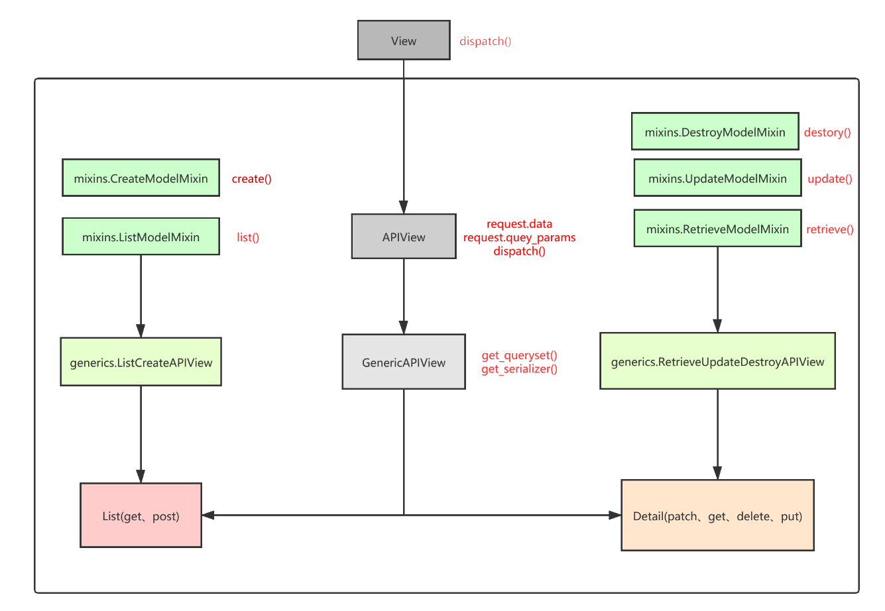

# DRF类视图

**目录：**

- 类视图介绍
- mixions封装常用操作
- generics基于类的视图

## 一、类视图介绍

使用类视图最好的好处就是可以创建复用的行为。

**1、mixins：**

我们常用的操作比如创建、更新、删除、查找。

```
mixins.ListModelMixin(获取所有数据)，mixins.CreateModelMixin(创建一条数据)
 
mixins.RetrieveModelMixin(获取一条数据)，mixins.UpdateModelMixin(全量更新和部分更新一条数据)，mixins.DestroyModelMixin(删除一条数据)
```

```python
from .serializers import UserSerializer
from .models import User
from rest_framework import mixins  #提供数据增、删、改、查功能
from rest_framework import generics  #提供 queryset和serializer_class
 
#mixins.ListModelMixin(获取所有数据)，mixins.CreateModelMixin(创建一条数据)，generics.GenericAPIView(继承APIView，提供queryset = None、serializer_class = None)
class UserList(mixins.ListModelMixin, mixins.CreateModelMixin, generics.GenericAPIView):
    queryset = User.objects.all()    #需要初始化generics.GenericAPIView 中的 queryset 和 serializer_class
    serializer_class = UserSerializer
 
    def get(self, request, *args, **kwargs):
        return self.list(request, *args, **kwargs)  #直接调ListModelMixin中封装好的list()方法
 
    def post(self, request, *args, **kwargs):
        return self.create(request, *args, **kwargs)  #直接调CreateModelMixin中封装好的 create()方法
 
#mixins.RetrieveModelMixin(获取一条数据)，mixins.UpdateModelMixin(全量更新和部分更新一条数据)，mixins.DestroyModelMixin(删除一条数据)，同样要继承generics.GenericAPIView
class UserDetail(mixins.RetrieveModelMixin, mixins.UpdateModelMixin, mixins.DestroyModelMixin, generics.GenericAPIView):
 
    queryset = User.objects.all()   #需要初始化generics.GenericAPIView 中的 queryset 和 serializer_class
    serializer_class = UserSerializer
 
    def get(self, request, *args, **kwargs):
        return self.retrieve(request, *args, **kwargs)  #直接调RetrieveModelMixin中封装好的retrieve()方法
 
    def put(self, request, *args, **kwargs):
        return self.update(request, *args, **kwargs)  #直接调UpdateModelMixin 中封装好的 update()方法
 
    def patch(self, request, *args, **kwargs):
        kwargs['partial'] = True
        return self.update(request, *args, **kwargs)  #直接调UpdateModelMixin 中封装好的 update()方法
 
    def delete(self, request, *args, **kwargs):
        return self.destroy(request, *args, **kwargs)   #直接调 DestroyModelMixin 中封装好的 destroy()
```


 **2、generics：**

```
generics.GenericAPIView(继承APIView，提供queryset = None、serializer_class = None)
 
generics.ListCreateAPIView(继承mixins.ListModelMixin、mixins.CreateModelMixin、generics.GenericAPIView)
 
generics.RetrieveUpdateDestroyAPIView(继承mixins.RetrieveModelMixin，mixins.UpdateModelMixin，mixins.DestroyModelMixin，generics.GenericAPIView)
```




### 1. view 父类

```python
class View1View(View):  # 父类
    pass 
```

### 2. 两个基类

#### APIView

```python
from rest_framework.views import APIView

class View1View(APIView):  # 继承View
    pass
```

#### GenericAPIView

```python
from rest_framework.generics import GenericAPIView


class View1View(GenericAPIView):  # 继承APIView
    queryset = models.Role.objects.all()
    serializer_class = PageSerializer
    pagination_class = MyPageNumberPagination

    def get(self, request, *args, **kwargs):
        roles = self.get_queryset()
        pagintion = self.paginate_queryset(roles)
        serializer = self.get_serializer(instance=pagintion, many=True)
        return Response(serializer.data)
```

### 3. 五个扩展类

#### ListModelMixin

#### CreateModelMixin

#### RetrieveModelMixin

#### UpdateModelMixin

#### DestroyModelMixin

### 4. 几个可用子类视图

#### CreateAPIView

提供 post 方法

继承自： GenericAPIView、CreateModelMixin

#### ListAPIView

提供 get 方法

继承自：GenericAPIView、ListModelMixin

#### RetrieveAPIView

提供 get 方法

继承自: GenericAPIView、RetrieveModelMixin

#### DestoryAPIView

提供 delete 方法

继承自：GenericAPIView、DestoryModelMixin

#### UpdateAPIView

提供 put 和 patch 方法

继承自：GenericAPIView、UpdateModelMixin

#### ListCreateAPIView

提供 get、post方法

继承自： GenericAPIView、ListModelMixin、CreateModelMixin

#### RetrieveUpdateAPIView

提供 get、put、patch方法

继承自： GenericAPIView、RetrieveModelMixin、UpdateModelMixin

#### RetrieveUpdateDestoryAPIView

提供 get、put、patch、delete方法

继承自：GenericAPIView、RetrieveModelMixin、UpdateModelMixin、DestoryModelMixin

### 5. 视图集

#### ViewSet

#### GenericViewSet

#### ModelViewSet

#### ReadOnlyModelViewSet