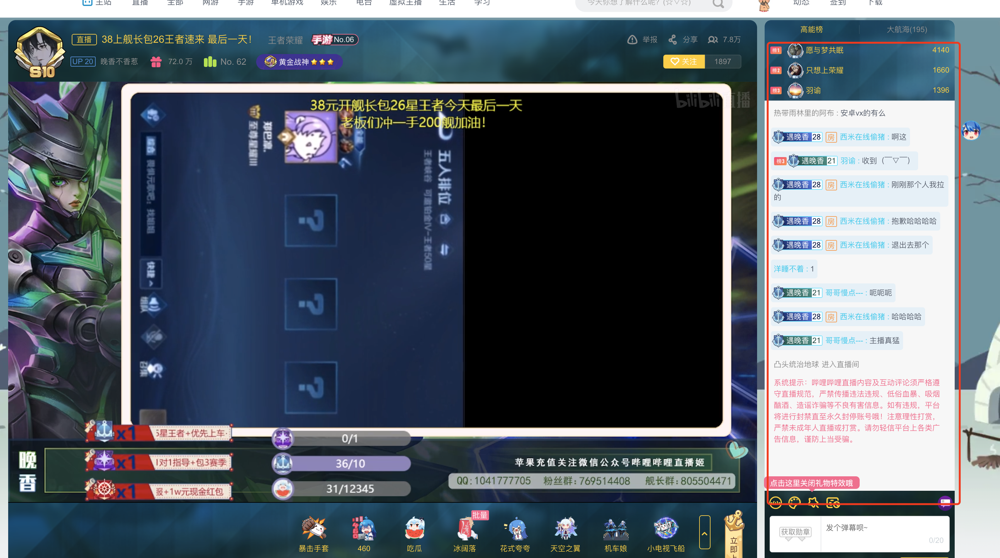
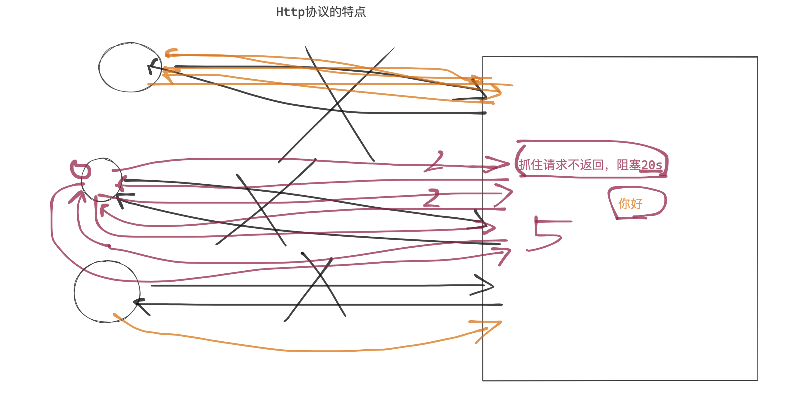
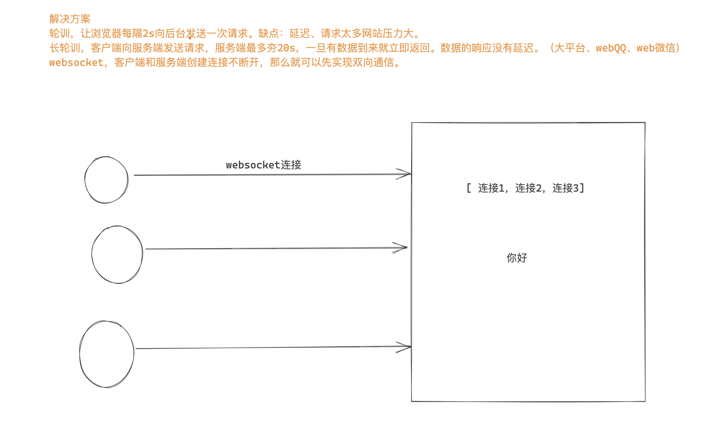
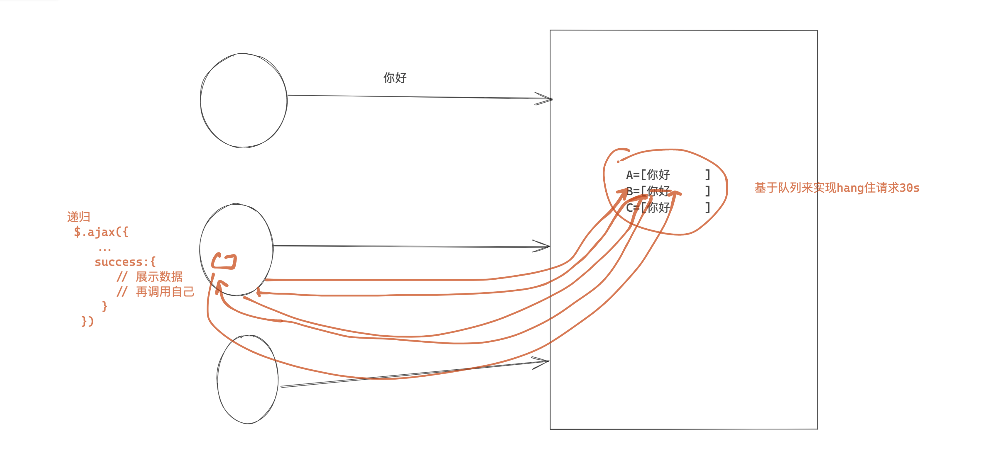
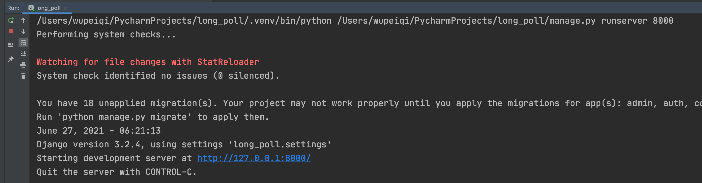
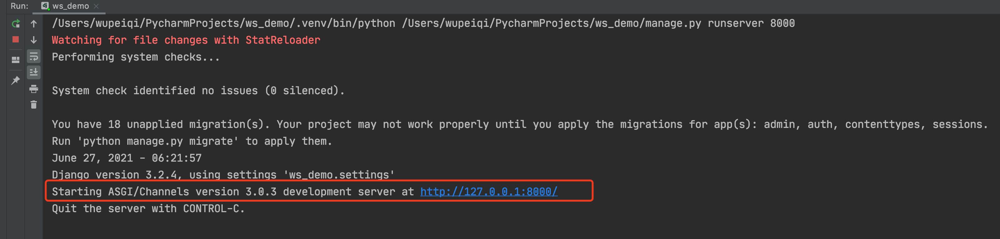

# day14 django（二)

今日概要：

- websocket & 聊天室的案例。
- websocket & gojs & 审批流的案例
- django核心的组件


## 1.websocket相关

请帮助我实现一个系统：20个用户同时打开网站，呈现出来的就是群聊。

- 我，你好
- 张坤
- 付乐乐
- 贾文龙
- ...










### 1.1 轮询

- 访问 /home/ 显示的聊天室界面。
- 点击发送内容，数据也可以发送到后台。
- 定时获取消息，然后再界面上展示。


### 1.2 长轮询



- 访问 /home/ 显示的聊天室界面。 + 每个用户创建一个队列。
- 点击发送内容，数据也可以发送到后台。+ 扔到每个人的队列中
- 递归获取消息，去自己的队列中获取数据， 然后再界面上展示。


问题：

- 服务端持有这个连接，压力是否会很大？

  ```
  如果即基于IO多复用 + 异步。
  ```

- 100线程，同时100个用户的请求。（15分钟）

- 为什么一个用户一个队列。

  - 示例：每个用户一个队列。

    ```
    队列   A
    队列	 B
    队列	 C
    ```

  - redis发布和订阅

    ```
                  					A,1
    发消息           [1]  			  B,1       
                  				    C,1
    ```


### 1.3 websocket

websocket，web版的 socket。

原来Web中：

- http协议，无状态&短连接。
  - 客户端主动连接服务端。
  - 客户端向服务端发送消息，服务端接收到返回数据。
  - 客户端接收到数据。
  - 断开连接。	
- https一些 + 对数据进行加密。

我们在开发过程中想要保留一些状态信息，基于Cookie来做。


现在支持：

- http协议，一次请求一次响应。
- websocket协议，创建连持久的连接不断开，基于这个连接可以进行收发数据。【服务端向客户端主动推送消息】
  - web聊天室
  - 实时图表，柱状图、饼图（Highcharts）


#### 1.3.1 WebSocket原理

- http协议

  - 连接
  - 数据传输
  - 断开连接

- websocket协议，是建立在http协议之上的。

  - 连接，客户端发起。

  - 握手（验证），客户端发送一个消息，后端接收到消息再做一些特殊处理并返回。 服务端支持websocket协议。

    - 客户端向服务端发送

      ```
      GET /chatsocket HTTP/1.1
      Host: 127.0.0.1:8002
      Connection: Upgrade
      Pragma: no-cache
      Cache-Control: no-cache
      Upgrade: websocket
      Origin: http://localhost:63342
      Sec-WebSocket-Version: 13
      Sec-WebSocket-Key: mnwFxiOlctXFN/DeMt1Amg==
      Sec-WebSocket-Extensions: permessage-deflate; client_max_window_bits
      ...
      ...
      \r\n\r\n
      ```

    - 服务端接收

      ```
      mnwFxiOlctXFN/DeMt1Amg== 与 magic string 进行拼接。
      magic string = "258EAFA5-E914-47DA-95CA-C5AB0DC85B11"
      
      v1 = "mnwFxiOlctXFN/DeMt1Amg==" + "258EAFA5-E914-47DA-95CA-C5AB0DC85B11"
      v2 = hmac1(v1)
      v3 = base64(v2)
      ```

      ```
      HTTP/1.1 101 Switching Protocols
      Upgrade:websocket
      Connection: Upgrade
      Sec-WebSocket-Accept: 密文
      ```

  - 收发数据（加密）

    ```
    b"adasdjf;akjdfp;iujas;ldkjfpaisudflkasjd;fkjas;dkjf;aksjdf;ajksd;fjka;sdijkf"
    ```

    - 先获取第2个字节，8位。 		10001010

    - 再获取第二个字节的后7位。      0001010  ->  payload len

      -   =127，2字节，8个字节，       其他字节（4字节 masking key + 数据）。
      -   =126，2字节，2个字节，       其他字节（4字节 masking key + 数据）。
      - <=125，2字节，                        其他字节（4字节 masking key + 数据）。

    - 获取masking key，然后对数据进行解密

      ```
      var DECODED = "";
      for (var i = 0; i < ENCODED.length; i++) {
          DECODED[i] = ENCODED[i] ^ MASK[i % 4];
      }
      ```

  - 断开连接。


#### 1.3.2 django框架

django默认不支持websocket，需要安装组件：

```
pip install channels
```


配置：

- 注册channels 

  ```python
  INSTALLED_APPS = [
      'django.contrib.admin',
      'django.contrib.auth',
      'django.contrib.contenttypes',
      'django.contrib.sessions',
      'django.contrib.messages',
      'django.contrib.staticfiles',
      'channels',
  ]
  ```

- 在settings.py中添加 asgi_application

  ```python
  ASGI_APPLICATION = "ws_demo.asgi.application"
  ```

- 修改asgi.py文件

  ```python
  import os
  from django.core.asgi import get_asgi_application
  from channels.routing import ProtocolTypeRouter, URLRouter
  
  from . import routing
  
  os.environ.setdefault('DJANGO_SETTINGS_MODULE', 'ws_demo.settings')
  
  # application = get_asgi_application()
  
  application = ProtocolTypeRouter({
      "http": get_asgi_application(),
      "websocket": URLRouter(routing.websocket_urlpatterns),
  })
  
  ```

- 在settings.py的同级目录创建 routing.py 

  ```python
  from django.urls import re_path
  
  from app01 import consumers
  
  websocket_urlpatterns = [
      re_path(r'ws/(?P<group>\w+)/$', consumers.ChatConsumer.as_asgi()),
  ]
  ```

- 在app01目录下创建 consumers.py，编写处理处理websocket的业务逻辑。

  ```python
  from channels.generic.websocket import WebsocketConsumer
  from channels.exceptions import StopConsumer
  
  
  class ChatConsumer(WebsocketConsumer):
      def websocket_connect(self, message):
          # 有客户端来向后端发送websocket连接的请求时，自动触发。
          # 服务端允许和客户端创建连接。
          self.accept()
  
      def websocket_receive(self, message):
          # 浏览器基于websocket向后端发送数据，自动触发接收消息。
          print(message)
          self.send("不要回复不要回复")
          # self.close()
  
      def websocket_disconnect(self, message):
          # 客户端与服务端断开连接时，自动触发。
          print("断开连接")
          raise StopConsumer()
  ```

  

在django中你要了解的：

- wsgi，在以前你们学习django时，都是用的wsgi。
  

- asgi，wsgi+异步+websocket。
  

  - http

    ```
    urls.py
    views.py
    ```

  - websocket

    ```
    routings.py
    consumers.py
    ```


#### 1.3.3 聊天室

- 访问地址看到聊天室的页面，http请求。

- 让客户端主动向服务端发起websocket连接，服务端接收到连接后通过（握手）。

  - 客户端，websocket。

    ```
    socket = new WebSocket("ws://127.0.0.1:8000/room/123/");
    ```

  - 服务端

    ```python
    from channels.generic.websocket import WebsocketConsumer
    from channels.exceptions import StopConsumer
    
    
    class ChatConsumer(WebsocketConsumer):
        def websocket_connect(self, message):  # self:表示当前用户过来创建的对象
            print("有人来连接了...")
            # 有客户端来向后端发送websocket连接的请求时，自动触发。
            self.accept()  # 服务端允许和客户端创建连接（握手）。
    ```
  
- 收发消息（客户端向服务端发消息）

  - 客户端

    socket.send()

    ```html
    <div>
        <input type="text" placeholder="请输入" id="txt">
        <input type="button" value="发送" onclick="sendMessage()">
    </div>
    
    <script>
        socket = new WebSocket("ws://127.0.0.1:8000/room/123/");
        
        function sendMessage() {
            let tag = document.getElementById("txt");
            socket.send(tag.value);
        }
    
    </script>
    ```

  - 服务端

    self.send()

    ```python
    from channels.generic.websocket import WebsocketConsumer
    from channels.exceptions import StopConsumer
    
    
    class ChatConsumer(WebsocketConsumer):
        def websocket_connect(self, message):
            print("有人来连接了...")
            # 有客户端来向后端发送websocket连接的请求时，自动触发。
            # 服务端允许和客户端创建连接（握手）。
            self.accept()
    
        def websocket_receive(self, message):
            # 浏览器基于websocket向后端发送数据，自动触发接收消息。
            text = message['text'] # {'type': 'websocket.receive', 'text': '阿斯蒂芬'}
            print("接收到消息-->", text)
    ```

- 收发消息（服务端主动发给客户端）

  - 服务端

    ```python
    from channels.generic.websocket import WebsocketConsumer
    from channels.exceptions import StopConsumer
    
    
    class ChatConsumer(WebsocketConsumer):
        def websocket_connect(self, message):
            print("有人来连接了...")
            # 有客户端来向后端发送websocket连接的请求时，自动触发。
            # 服务端允许和客户端创建连接（握手）。
            self.accept()
    
            # 服务端给客户端发送消息
            self.send("来了呀客官")
    ```

  - 客户端

    ```html
    <!DOCTYPE html>
    <html lang="en">
    <head>
        <meta charset="UTF-8">
        <title>Title</title>
        <style>
            .message {
                height: 300px;
                border: 1px solid #dddddd;
                width: 100%;
            }
        </style>
    </head>
    <body>
    <div class="message" id="message"></div>
    <div>
        <input type="text" placeholder="请输入" id="txt">
        <input type="button" value="发送" onclick="sendMessage()">
    </div>
    
    <script>
        // http://www.baidu.com
        // ws://www.baidu.com
        socket = new WebSocket("ws://127.0.0.1:8000/room/123/");
    
        // 当websocket接收到服务端发来的消息时，自动会触发这个函数。
        socket.onmessage = function (event) {
            console.log(event.data);
        }
    
        function sendMessage() {
            let tag = document.getElementById("txt");
            socket.send(tag.value);
        }
    
    </script>
    
    </body>
    </html>
    
    ```

    


整合在一起：

前端：

```html
<!DOCTYPE html>
<html lang="en">
<head>
    <meta charset="UTF-8">
    <title>Title</title>
    <style>
        .message {
            height: 300px;
            border: 1px solid #dddddd;
            width: 100%;
        }
    </style>
</head>
<body>
<div class="message" id="message"></div>
<div>
    <input type="text" placeholder="请输入" id="txt">
    <input type="button" value="发送" onclick="sendMessage()">
    <input type="button" value="关闭连接" onclick="closeConn()">
</div>

<script>

    socket = new WebSocket("ws://127.0.0.1:8000/room/123/");

    // 创建好连接之后自动触发（ 服务端执行self.accept() )
    socket.onopen = function (event) {
        let tag = document.createElement("div");
        tag.innerText = "[连接成功]";
        document.getElementById("message").appendChild(tag);
    }

    // 当websocket接收到服务端发来的消息时，自动会触发这个函数。
    socket.onmessage = function (event) {
        let tag = document.createElement("div");
        tag.innerText = event.data;
        document.getElementById("message").appendChild(tag);
    }

    // 服务端主动断开连接时，这个方法也被触发。
    socket.onclose = function (event) {
        let tag = document.createElement("div");
        tag.innerText = "[断开连接]";
        document.getElementById("message").appendChild(tag);
    }

    function sendMessage() {
        let tag = document.getElementById("txt");
        socket.send(tag.value);
    }

    function closeConn() {
        socket.close(); // 向服务端发送断开连接的请求
    }

</script>

</body>
</html>

```


```python
from channels.generic.websocket import WebsocketConsumer
from channels.exceptions import StopConsumer


class ChatConsumer(WebsocketConsumer):
    def websocket_connect(self, message):
        print("有人来连接了...")
        # 有客户端来向后端发送websocket连接的请求时，自动触发。
        # 服务端允许和客户端创建连接（握手）。
        self.accept()

        # 服务端给客户端发送消息
        # self.send("来了呀客官")

    def websocket_receive(self, message):
        # 浏览器基于websocket向后端发送数据，自动触发接收消息。
        text = message['text']  # {'type': 'websocket.receive', 'text': '阿斯蒂芬'}
        print("接收到消息-->", text)

        if text == "关闭":
            # 服务端主动关闭连接，给客户端发送一条断开连接的消息。
            self.close()
            # raise StopConsumer() # 如果服务端断开连接时，执行 StopConsumer异常，那么websocket_disconnect方法不再执行。
            return

        res = "{}SB".format(text)
        self.send(res)

    def websocket_disconnect(self, message):
        print("断开连接了")
        raise StopConsumer()

```


my

```
from channels.generic.websocket import WebsocketConsumer
from channels.exceptions import StopConsumer


class ChatConsumer(WebsocketConsumer):
    def websocket_connect(self, message):
        # 有客户端来向后端发送websocket连接的请求时，自动触发。
        # 服务端允许和客户端创建连接。
        print("前端过来连接了！self.accept()")
        self.accept()

        # for row in range(1, 11):
        #     self.send("小弟弟来了啊！！%d" % row)

    def websocket_receive(self, message):
        # 浏览器基于websocket向后端发送数据，自动触发接收消息。
        print("用户传递过来的数据：", message)  # {'type': 'websocket.receive', 'text': '123'}
        # self.send("不要回复不要回复")

        res = "{}--SB".format(message.get("text"))
        self.send(res)  # 用户传递过来的值加上--SB
        self.close()  # 服务端主动断开连接
        raise StopConsumer()  # 如果服务端断开连接时，执行 StopConsumer异常，那么websocket_disconnect方法不再执行。

    def websocket_disconnect(self, message):
        # 客户端与服务端断开连接时，自动触发。
        print("断开连接")
        raise StopConsumer()
```

```
<!DOCTYPE html>
<html lang="en">
<head>
    <meta charset="UTF-8">
    <title>websocket</title>
    <style>
        .message {
            height: 300px;
            border: 1px solid #dddddd;
            width: 100%;
        }
    </style>
</head>
<body>
<div class="message" id="message"></div>
<div>
    <input type="text" placeholder="请输入" id="txt">
    <input type="button" value="发送" onclick="sendMessage()">
    <input type="button" value="关闭连接" onclick="closeConn()">
</div>

<script>
    // http://www.baidu.com
    // ws://www.baidu.com
    socket = new WebSocket("ws://127.0.0.1:8000/ws/123/");
    console.log("前端创建websocket", socket);

    //1、发送消息socket.send()
    function sendMessage() {
        let tag = document.getElementById("txt");
        socket.send(tag.value);  //获取用户的输入的值
    }

    //2、当websocket接收到服务端发来的消息时，自动会触发这个函数。接收消息event
    socket.onmessage = function (event) {
        console.log("当websocket接收到服务端发来的消息时，自动会触发这个函数:", event.data);
        let tag = document.createElement("div");
        tag.innerText = event.data;
        document.getElementById("message").appendChild(tag);//添加一个div
    };

    //3、服务器创建好连接之后自动触发（ 服务端执行self.accept() )
    socket.onopen = function (event) {
        console.log("后端通过self.accept(),前端自动出发：", event);
        let tag = document.createElement("div");
        tag.innerText = "[连接成功]";
        document.getElementById("message").appendChild(tag);  //添加一个div
    };

    //4、服务器服务端主动断开连接时，这个方法也被触发。
    socket.onclose = function (event) {
        console.log("服务端主动断开连接时，这个方法也被触发");
        let tag = document.createElement("div");
        tag.innerText = "[断开连接]";
        document.getElementById("message").appendChild(tag);
    };

    //5、向服务器发送断开连接的请求
    function closeConn() {
        console.log("socket.close()关闭连接");
        socket.close(); // 向服务端发送断开连接的请求
    }
</script>

</body>
</html>
```


#### 小结

基于django实现websocket请求，但只能对某个人进行处理。

self:服务端和客户端创建的连接对象


#### 1.3.4 群聊（一）

**创建一个列表，把所有的连接对象self添加到列表中。接收和发送数据的时候，遍历列表。关闭连接的时候从列表中删除**

- 前端代码

  ```html
  <!DOCTYPE html>
  <html lang="en">
  <head>
      <meta charset="UTF-8">
      <title>Title</title>
      <style>
          .message {
              height: 300px;
              border: 1px solid #dddddd;
              width: 100%;
          }
      </style>
  </head>
  <body>
  <div class="message" id="message"></div>
  <div>
      <input type="text" placeholder="请输入" id="txt">
      <input type="button" value="发送" onclick="sendMessage()">
      <input type="button" value="关闭连接" onclick="closeConn()">
  </div>
  
  <script>
  
      socket = new WebSocket("ws://127.0.0.1:8000/room/123/");
  
      // 创建好连接之后自动触发（ 服务端执行self.accept() )
      socket.onopen = function (event) {
          let tag = document.createElement("div");
          tag.innerText = "[连接成功]";
          document.getElementById("message").appendChild(tag);
      }
  
      // 当websocket接收到服务端发来的消息时，自动会触发这个函数。
      socket.onmessage = function (event) {
          let tag = document.createElement("div");
          tag.innerText = event.data;
          document.getElementById("message").appendChild(tag);
      }
  
      // 服务端主动断开连接时，这个方法也被触发。
      socket.onclose = function (event) {
          let tag = document.createElement("div");
          tag.innerText = "[断开连接]";
          document.getElementById("message").appendChild(tag);
      }
  
      function sendMessage() {
          let tag = document.getElementById("txt");
          socket.send(tag.value);
      }
  
      function closeConn() {
          socket.close(); // 向服务端发送断开连接的请求
      }
  
  </script>
  
  </body>
  </html>
  
  ```

- 后端

  ```python
  from channels.generic.websocket import WebsocketConsumer
  from channels.exceptions import StopConsumer
  
  USER_LIST = []
  
  class ChatConsumer(WebsocketConsumer):
      def websocket_connect(self, message):
          # 有客户端来向后端发送websocket连接的请求时，自动触发。
          self.accept()
          self.send("欢迎来到聊天室！")
          USER_LIST.append(self)  # 把连接对象添加到列表中
  
      def websocket_receive(self, message):
          res = "{}--SB".format(message.get("text"))
          for row in USER_LIST:
              row.send(res)  # 用户传递过来的值加上--SB
  
      def websocket_disconnect(self, message):
          USER_LIST.remove(self)  # 删除掉列表的self
          raise StopConsumer()
  
  ```
  
  

#### 1.3.5 群聊（二）

```
https://www.cnblogs.com/wupeiqi/articles/9593858.html
```


基于channels中提供channel layers来实现。

需要修改二个地方代码

- 1、setting中配置。

  ```python
  CHANNEL_LAYERS = {
      "default": {
          "BACKEND": "channels.layers.InMemoryChannelLayer",
      }
  }
  ```

  **基于channels-redis使用方式https://www.cnblogs.com/wupeiqi/articles/9593858.html**

  ```
  pip3 install channels-redis
  ```

  ```python
  CHANNEL_LAYERS = {
      "default": {
          "BACKEND": "channels_redis.core.RedisChannelLayer",
          "CONFIG": {
              "hosts": [('10.211.55.25', 6379)]
          },
      },
  }
  ```

- 2、consumers中特殊的代码。

  - ```
    self.scope['url_route']['kwargs'].get("group")：获取分组的数据url ws/(?P<group>\w+)
    ```
  
  - ```
    async_to_sync(self.channel_layer.group_add)(group, self.channel_name)  将这个客户端的连接对象加入到某个地方（内存 or redis）
    ```
  
  - ```
    async_to_sync(self.channel_layer.group_send)(group, {"type": "xx.oo", 'message': message}) 通知组内的所有客户端，执行 xx_oo 方法，在此方法中自己可以去定义任意的功能。
    ```
  
  - ```
    async_to_sync(self.channel_layer.group_discard)(group, self.channel_name)  删除某个组的，连接对象
    ```
  
  ```python
  from channels.generic.websocket import WebsocketConsumer
  from channels.exceptions import StopConsumer
  from asgiref.sync import async_to_sync
  
  
  class ChatConsumer(WebsocketConsumer):
      def websocket_connect(self, message):
          # 接收这个客户端的连接
          self.accept()
  
          # 获取群号，获取路由匹配中的分组
          group = self.scope['url_route']['kwargs'].get("group")
  
          # 将这个客户端的连接对象加入到某个地方（内存 or redis）
          async_to_sync(self.channel_layer.group_add)(group, self.channel_name)
  
      def websocket_receive(self, message):
          group = self.scope['url_route']['kwargs'].get("group")
  
          # 通知组内的所有客户端，执行 xx_oo 方法，在此方法中自己可以去定义任意的功能。
          async_to_sync(self.channel_layer.group_send)(group, {"type": "xx.oo", 'message': message})
  
      def xx_oo(self, event):
          text = event['message']['text']
          self.send(text)
  
      def websocket_disconnect(self, message):
          group = self.scope['url_route']['kwargs'].get("group")
  
          async_to_sync(self.channel_layer.group_discard)(group, self.channel_name)
          raise StopConsumer()
  
  ```
  
  


my

```
path('home/', views.home),

def home(request):
    """主页"""
    qq_group = request.GET.get("qq_group")  # qq群，用于websocket的时候分组

    return render(request, "home.html", {"qq_group": qq_group})
```

```
<!DOCTYPE html>
<html lang="en">
<head>
    <meta charset="UTF-8">
    <title>websocket</title>
    <style>
        .message {
            height: 300px;
            border: 1px solid #dddddd;
            width: 100%;
        }
    </style>
</head>
<body>
<div class="message" id="message"></div>
<div>
    <input type="text" placeholder="请输入" id="txt">
    <input type="button" value="发送" onclick="sendMessage()">
    <input type="button" value="关闭连接" onclick="closeConn()">
</div>

<script>
    // http://www.baidu.com
    // ws://www.baidu.com
    socket = new WebSocket("ws://127.0.0.1:8000/ws/{{ qq_group }}/");
    console.log("前端创建websocket", socket);

    //1、发送消息socket.send()
    function sendMessage() {
        let tag = document.getElementById("txt");
        socket.send(tag.value);  //获取用户的输入的值
    }

    //2、当websocket接收到服务端发来的消息时，自动会触发这个函数。接收消息event
    socket.onmessage = function (event) {
        console.log("当websocket接收到服务端发来的消息时，自动会触发这个函数:", event.data);
        let tag = document.createElement("div");
        tag.innerText = event.data;
        document.getElementById("message").appendChild(tag);//添加一个div
    };

    //3、创建好连接之后自动触发（ 服务端执行self.accept() )
    socket.onopen = function (event) {
        console.log("后端通过self.accept(),前端自动出发：", event);
        let tag = document.createElement("div");
        tag.innerText = "[连接成功]";
        document.getElementById("message").appendChild(tag);  //添加一个div
    };

    //4、服务端主动断开连接时，这个方法也被触发。
    socket.onclose = function (event) {
        console.log("服务端主动断开连接时，这个方法也被触发");
        let tag = document.createElement("div");
        tag.innerText = "[断开连接]";
        document.getElementById("message").appendChild(tag);
    };

    //5、向服务器发送断开连接的请求
    function closeConn() {
        console.log("socket.close()关闭连接");
        socket.close(); // 向服务端发送断开连接的请求
    }
</script>

</body>
</html>

```


```
from django.urls import re_path

from app01 import consumers

websocket_urlpatterns = [
    re_path(r'ws/(?P<group>\w+)/$', consumers.ChatConsumer.as_asgi()),
]
```

```
from channels.generic.websocket import WebsocketConsumer
from channels.exceptions import StopConsumer
from asgiref.sync import async_to_sync


class ChatConsumer(WebsocketConsumer):
    """
    都是先找对应的组名，在通过组名去找下面的用户连接对象
        1、前端创建socket = new WebSocket("ws://127.0.0.1:8000/ws/{{ qq_group }}/"); websocket对象，用户访问浏览器，后端通过self.accept()接收客户端连接
        2、通过self.scope['url_route']['kwargs'].get("group")，获取路由中分组的值     re_path(r'ws/(?P<group>\w+)/$', consumers.ChatConsumer.as_asgi()),
        3、self.channel_layer.group_add是异步的，我们现在通过async_to_sync() 把异步变成同步（用异步的时候就自己改）
        4、async_to_sync(self.channel_layer.group_add)(group, self.channel_name) ，把连接对象放入对应的组名中group
        5、客户端发消息的时候执行 xx_oo 方法通过self.send(发送给客户端的消息)[在此方法中自己可以去定义任意的功能]。async_to_sync(self.channel_layer.group_send)(group, {"type": "xx.oo", 'message': message})
        6、断开async_to_sync(self.channel_layer.group_discard)(group, self.channel_name)
    """
    def websocket_connect(self, message):
        # 接收这个客户端的连接
        self.accept()

        # 获取群号，获取路由匹配中的
        group = self.scope['url_route']['kwargs'].get("group")  # qq_group

        # 将这个客户端的连接对象加入到某个地方（内存 or redis）
        # async_to_sync,把异步变成同步
        async_to_sync(self.channel_layer.group_add)(group, self.channel_name)  # group分组，把连接用户分到那个组中（组名，连接对象）

    def websocket_receive(self, message):
        group = self.scope['url_route']['kwargs'].get("group")

        # 通知组内的所有客户端，执行 xx_oo 方法，在此方法中自己可以去定义任意的功能。
        async_to_sync(self.channel_layer.group_send)(group, {"type": "xx.oo", 'message': message})

    def xx_oo(self, event):
        text = event['message']['text']
        self.send(text)

    def websocket_disconnect(self, message):
        group = self.scope['url_route']['kwargs'].get("group")

        async_to_sync(self.channel_layer.group_discard)(group, self.channel_name)
        raise StopConsumer()
```


### 总结

- websocket是什么？协议。
- django中实现websocket，channels组件。
  - 单独连接和收发数据。
  - 手动创建列表 & channel layers。


提醒：

- 运维&运维开发的同学，代码发布系统项目。（django 1.11.7讲）
- 工单系统


## 2.工单系统


### 2.1 前端gojs

```
官网：https://gojs.net.cn/learn/index.html
```

```
插件js下载：https://gojs.net.cn/download.html
```


示例1

```html
<!DOCTYPE html>
<html lang="en">
<head>
    <meta charset="UTF-8">
    <title>Title</title>
</head>
<body>
<div id="myDiagramDiv" style="width:500px; height:350px; background-color: #DAE4E4;"></div>


<script src="gojs/go.js"></script>

<script>
    var $ = go.GraphObject.make;

    // 第一步：创建图表
    var myDiagram = $(go.Diagram, "myDiagramDiv"); // 创建图表，用于在页面上画图

    // 第二步：创建一个节点，内容为武沛齐
    // $(go.TextBlock, {text: "武沛齐"}) 创建文本
    var node = $(go.Node, $(go.TextBlock, {text: "武沛齐"}));

    // 第三步：将节点添加到图表中
    myDiagram.add(node);
</script>
</body>
</html>

```

示例2

```html
<!DOCTYPE html>
<html lang="en">
<head>
    <meta charset="UTF-8">
    <title>Title</title>
</head>
<body>
<div id="myDiagramDiv" style="width:500px; height:350px; background-color: #DAE4E4;"></div>


<script src="gojs/go.js"></script>

<script>
    var $ = go.GraphObject.make;
    // 第一步：创建图表
    var myDiagram = $(go.Diagram, "myDiagramDiv"); // 创建图表，用于在页面上画图

	// 创建多个节点
    var node1 = $(go.Node, $(go.TextBlock, {text: "武沛齐"}));
    myDiagram.add(node1);

    var node2 = $(go.Node, $(go.TextBlock, {text: "武沛齐", stroke: 'red'}));
    myDiagram.add(node2);

    var node3 = $(go.Node, $(go.TextBlock, {text: "武沛齐", background: 'lightblue'}));
    myDiagram.add(node3);


</script>
</body>
</html>
```

示例3

```html
<!DOCTYPE html>
<html lang="en">
<head>
    <meta charset="UTF-8">
    <title>Title</title>
</head>
<body>
<div id="myDiagramDiv" style="width:500px; height:350px; background-color: #DAE4E4;"></div>


<script src="gojs/go.js"></script>
<script src="gojs/Figures.js"></script>

<script>
    var $ = go.GraphObject.make;

    var myDiagram = $(go.Diagram, "myDiagramDiv"); // 创建图表，用于在页面上画图

    var node1 = $(go.Node,
        $(go.Shape, {figure: "Ellipse", width: 40, height: 40})
    );
    myDiagram.add(node1);

    var node2 = $(go.Node,
        $(go.Shape, {figure: "RoundedRectangle", width: 40, height: 40, fill: 'green',stroke:'red'})
    );
    myDiagram.add(node2);

    var node3 = $(go.Node,
        $(go.Shape, {figure: "Rectangle", width: 40, height: 40, fill: null})
    );
    myDiagram.add(node3);


    var node4 = $(go.Node,
        $(go.Shape, {figure: "Diamond", width: 40, height: 40, fill: '#ddd'})
    );
    myDiagram.add(node4);

    // 需要引入Figures.js
    var node5 = $(go.Node,
        $(go.Shape, {figure: "Club", width: 40, height: 40, fill: 'red'})
    );
    myDiagram.add(node5);

</script>
</body>
</html>

```

示例4

```html
<!DOCTYPE html>
<html lang="en">
<head>
    <meta charset="UTF-8">
    <title>Title</title>
</head>
<body>
<div id="myDiagramDiv" style="width:500px; height:350px; background-color: #DAE4E4;"></div>


<script src="gojs/go.js"></script>
<script src="gojs/Figures.js"></script>

<script>
    var $ = go.GraphObject.make;
    var myDiagram = $(go.Diagram, "myDiagramDiv"); // 创建图表，用于在页面上画图


    var node1 = $(go.Node,
        "Vertical",
        {
            background: 'yellow',
            padding: 8
        },
        $(go.Shape, {figure: "Ellipse", width: 40, height: 40}),
        $(go.TextBlock, {text: "武沛齐"})
    );
    myDiagram.add(node1);


    var node2 = $(go.Node,
        "Horizontal",
        {
            background: 'white',
            padding: 5
        },
        $(go.Shape, {figure: "RoundedRectangle", width: 40, height: 40}),
        $(go.TextBlock, {text: "武沛齐"})
    );
    myDiagram.add(node2);

    var node3 = $(go.Node,
        "Auto",
        $(go.Shape, {figure: "Ellipse", width: 80, height: 80, background: 'green', fill: 'red'}),
        $(go.TextBlock, {text: "武沛齐"})
    );
    myDiagram.add(node3);


</script>
</body>
</html>

```

示例5

```html
<!DOCTYPE html>
<html lang="en">
<head>
    <meta charset="UTF-8">
    <title>Title</title>
</head>
<body>
<div id="myDiagramDiv" style="width:800px; min-height:450px; background-color: #DAE4E4;"></div>


<script src="gojs/go-debug.js"></script>

<script>
    var $ = go.GraphObject.make;

    var myDiagram = $(go.Diagram, "myDiagramDiv",
        {layout: $(go.TreeLayout, {angle: 0})}
    ); // 创建图表，用于在页面上画图


    var startNode = $(go.Node, "Auto",
        $(go.Shape, {figure: "Ellipse", width: 40, height: 40, fill: '#79C900', stroke: '#79C900'}),
        $(go.TextBlock, {text: '开始', stroke: 'white'})
    );
    myDiagram.add(startNode);


    var downloadNode = $(go.Node, "Auto",
        $(go.Shape, {figure: "RoundedRectangle", height: 40, fill: '#79C900', stroke: '#79C900'}),
        $(go.TextBlock, {text: '下载代码', stroke: 'white'})
    );
    myDiagram.add(downloadNode);


    var startToDownloadLink = $(go.Link,
        {fromNode: startNode, toNode: downloadNode},
        $(go.Shape, {strokeWidth: 1}),
        $(go.Shape, {toArrow: "OpenTriangle", fill: null, strokeWidth: 1})
    );
    myDiagram.add(startToDownloadLink);


    var zipNode = $(go.Node, "Auto",
        $(go.Shape, {figure: "RoundedRectangle", height: 40, fill: '#79C900', stroke: '#79C900'}),
        $(go.TextBlock, {text: '本地打包', stroke: 'white'})
    );
    myDiagram.add(zipNode);

    var downloadToZipLink = $(go.Link,
        {fromNode: downloadNode, toNode: zipNode},
        $(go.Shape, {strokeWidth: 1}),
        $(go.Shape, {toArrow: "OpenTriangle", fill: null, strokeWidth: 1})
    );
    myDiagram.add(downloadToZipLink);


    for (var i = 1; i < 6; i++) {

        var node = $(go.Node, "Auto",
            $(go.Shape, {figure: "RoundedRectangle", height: 40, fill: 'lightgray', stroke: 'lightgray'}),
            $(go.TextBlock, {text: '服务器' + i, stroke: 'white', margin: 5})
        );
        myDiagram.add(node);

        var nodeToZipLink = $(go.Link,
            {fromNode: zipNode, toNode: node, routing: go.Link.Orthogonal},
            $(go.Shape, {strokeWidth: 1, stroke: 'lightgray'}),
            $(go.Shape, {toArrow: "OpenTriangle", fill: null, strokeWidth: 1, stroke: 'lightgray'})
        );
        myDiagram.add(nodeToZipLink);
    }

</script>
</body>
</html>

```

示例6

```html
<!DOCTYPE html>
<html lang="en">
<head>
    <meta charset="UTF-8">
    <title>Title</title>

</head>
<body>
<div id="diagramDiv" style="width:100%; min-height:450px; background-color: #DAE4E4;"></div>


<script src="gojs/go-no-logo.js"></script>
<script>
    var $ = go.GraphObject.make;

    var diagram = $(go.Diagram, "diagramDiv", {
        layout: $(go.TreeLayout, {
            angle: 0,
            nodeSpacing: 20,
            layerSpacing: 70
        })
    });

    // 节点的模板
    diagram.nodeTemplate = $(go.Node, "Auto",
        $(go.Shape, {
            figure: "RoundedRectangle",
            fill: 'lightgray',
            stroke: 'lightgray'
        }, new go.Binding("figure", "figure"), new go.Binding("fill", "color"), new go.Binding("stroke", "color")),
        $(go.TextBlock, {margin: 8}, new go.Binding("text", "text"))
    );

    // 连接的模板
    diagram.linkTemplate = $(go.Link,
        {routing: go.Link.Orthogonal},
        $(go.Shape, {stroke: 'lightgray'}, new go.Binding('stroke', 'link_color')),
        $(go.Shape, {toArrow: "OpenTriangle", stroke: 'lightgray'}, new go.Binding('stroke', 'link_color')),
        $(go.TextBlock, {font: '8pt serif', segmentOffset: new go.Point(0, -10)}, new go.Binding("text", "link_text"))
    );

    var nodeDataArray = [
        {key: "start", text: '开始', figure: 'Ellipse', color: "lightgreen"},
        {key: "download", parent: 'start', text: '下载代码', color: "lightgreen", link_text: '执行中...'},
        {key: "compile", parent: 'download', text: '本地编译', color: "lightgreen"},
        {key: "zip", parent: 'compile', text: '打包', color: "red", link_color: 'red'},
        {key: "c1", text: '服务器1', parent: "zip"},
        {key: "c11", text: '服务重启', parent: "c1",color: "lightgrey"},
        {key: "c2", text: '服务器2', parent: "zip"},
        {key: "c21", text: '服务重启', parent: "c2"},
        {key: "c3", text: '服务器3', parent: "zip"},
        {key: "c31", text: '服务重启', parent: "c3"},
    ];

    diagram.model = new go.TreeModel(nodeDataArray);

    /*
    diagram.model.addNodeData({key: "c4", text: '服务器3', parent: "c3", color: "lightgreen"})
    var c1 = diagram.model.findNodeDataForKey("c1");
    diagram.model.setDataProperty(c1, "color", "red");
    diagram.model.setDataProperty(c1, "link_text", "执行中...");
    diagram.model.setDataProperty(c1, "link_color", "red");
    */

</script>
</body>
</html>

```

示例7

```html
<!DOCTYPE html>
<html lang="en">
<head>
    <meta charset="UTF-8">
    <title>Title</title>

</head>
<body>
<div id="diagramDiv" style="width:100%; min-height:450px; background-color: #DAE4E4;"></div>


<script src="gojs/go-no-logo.js"></script>
<script>
    var $ = go.GraphObject.make;
    var diagram = $(go.Diagram, "diagramDiv", {
        layout: $(go.TreeLayout, {
            angle: 0,
            nodeSpacing: 20,
            layerSpacing: 70
        })
    });

    // 节点
    var nodeDataArray = [
        {key: "Alpha"},
        {key: "Beta"},
        {key: "papa"},
        {key: "bilibili"}
    ];

    // 关系
    var linkDataArray = [
        {from: "Alpha", to: "Beta"},
        {from: "Alpha", to: "papa"},
        {from: "Beta", to: "bilibili"},
        {from: "papa", to: "bilibili"},
    ];

    diagram.model = new go.GraphLinksModel(nodeDataArray, linkDataArray);


    diagram.model.addNodeData({key: "c4", text: '服务器3', color: "lightgreen"})
    diagram.model.addLinkData({from: "bilibili", to: 'c4'})


</script>
</body>
</html>
```


### 2.2 后端django + websocket

- 表结构
- websocket+gojs
  - 流程图标 + go.js 
  - 同意 or 不同意

models.py

```python
from django.db import models

"""
需求：
    1、员工请假，提交工单（Task，请假条）
    2、需要有["村长", "乡长", "县长", "市长"]4个领导审批,上一个领导审核通过，才交给下一个领导，并修改初始状态未待审核。如果和没有到那一级领导就是未审批
    3、所有说当员工创建工单的时候，给["村长", "乡长", "县长", "市长"]4个领导类型分别创建一条数据村长：status=2 乡长，县长，市长status=1(当村长status=3，修改乡长status=2,村长=4，后面的不做修改)
"""


# class User(models.Model):
#     """用户"""
#     pass
#
#
# class UserType(models.Model):
#     """用户类型"""
#     pass

class Task(models.Model):
    """ 工单/任务表，请假/购买/调休... """
    title = models.CharField(verbose_name="标题", max_length=64)
    detail = models.TextField(verbose_name="描述", null=True, blank=True)


class AuditTask(models.Model):
    """ 审批记录 """
    task = models.ForeignKey(verbose_name="任务/工单", to="Task", on_delete=models.CASCADE)
    status_choices = ((1, "未审批"), (2, "待审批"), (3, "通过"), (4, "未通过"),)
    status_mapping = {1: "lightgrey", 2: "lightgreen", 3: "green", 4: "red", }
    status = models.SmallIntegerField(verbose_name="状态", choices=status_choices)
    # 假设用户
    user = models.CharField(verbose_name="审批者", max_length=32)
    parent = models.ForeignKey(
        verbose_name="上一级（下一个）后一级领导",
        to="AuditTask",
        null=True,
        blank=True,
        related_name="tasks",
        on_delete=models.CASCADE
    )
```


1、配置django的websocket


urls.py

```python
from django.contrib import admin
from django.urls import path

from app03 import views as VIEWS
urlpatterns = [
    path('index/', VIEWS.index),  # 通过用户类型展示对应的数据
    path('audit/', VIEWS.audit),  # 通过点击去审核进入审核详细页面，看到工单详细，和gojs流程图
]
```

views.py

```python
from django.shortcuts import render

from app03.models import AuditTask, Task


def index(request):
    """通过用户类型展示对应数据"""
    type = request.GET.get("type")
    # 加select_related它可以内部进行连接，不用在做一次查询，减少服务器的压力
    data_list = AuditTask.objects.filter(user=type, status=2).select_related("task")
    return render(request, "index.html", {"data_list": data_list, "user": type})


def audit(request):
    """通过点击去审核，进去工单详细，并展示gojs流程图"""
    user = request.GET.get("user")
    tid = request.GET.get("tid")
    task_object = Task.objects.filter(id=tid).first()
    return render(request, "audit.html", {"task_object": task_object, "user": user, "task_id": tid})
```

index.html

```html
<!DOCTYPE html>
<html lang="en">
<head>
    <meta charset="UTF-8">
    <title>Title</title>
</head>
<body>
<h1>工单列表</h1>
<table border="1">
    <thead>
    <tr>
        <th>工单</th>
        <th>状态</th>
        <th>审核人员</th>
        <th>操作</th>
    </tr>
    </thead>
    <tbody>
    
        <tr>
            <td>{{ item.task.title }}</td>
            <td>{{ item.get_status_display }}</td>
            <td>{{ item.user }}</td>
            <td>
                <a href="/audit/?user={{ user }}&tid={{ item.task_id }}">去审批</a>
            </td>
        </tr>
    
    </tbody>
</table>
</body>
</html>
```

audit.html

```python
<!DOCTYPE html>
<html lang="en">
<head>
    <meta charset="UTF-8">
    <title>Title</title>
    <style>
        .go {
            width: 100%;
            min-height: 350px;
            background-color: #DAE4E4;
        }
    </style>
</head>
<body>
<div id="diagramDiv" class="go"></div>

<div class="content">
    <div>{{ task_object.title }}</div>
    <div>{{ task_object.detail }}</div>
    <div>
        <input type="button" value="同意" onclick="agree();">
        <input type="button" value="不同意" onclick="disAgree();">
    </div>

</div>

<script src="gojs/go.js"></script>
<script>

    function initWebSocket() {
        //创建wocket连接
        socket = new WebSocket("ws://127.0.0.1:8000/audit/{{ task_id }}/");

        socket.onmessage = function (event) {
            // 判断，全部 or 修改局部
            console.log(event,111111111);
            let dataDict = JSON.parse(event.data);
            if (dataDict.msg_type === 1) {
                diagram.model = new go.TreeModel(dataDict.node_data_array);
            } else {
                // 局部更新
                let node = diagram.model.findNodeDataForKey(dataDict.key);
                diagram.model.setDataProperty(node, "color", dataDict.color);
            }

        }
    }

    //gojs模板
    var diagram;
    var socket;
    var $;

    function initGoJs() {
        $ = go.GraphObject.make;

        diagram = $(go.Diagram, "diagramDiv", {
            layout: $(go.TreeLayout, {
                angle: 0,
                nodeSpacing: 20,
                layerSpacing: 70
            })
        });

        // 节点的模板
        diagram.nodeTemplate = $(go.Node, "Auto",
            $(go.Shape, {
                figure: "RoundedRectangle",
                fill: 'lightgray',
                stroke: 'lightgray'
            }, new go.Binding("figure", "figure"), new go.Binding("fill", "color"), new go.Binding("stroke", "color")),
            $(go.TextBlock, {margin: 8}, new go.Binding("text", "text"))
        );

        // 连接的模板
        diagram.linkTemplate = $(go.Link,
            {routing: go.Link.Orthogonal},
            $(go.Shape, {stroke: 'lightgray'}, new go.Binding('stroke', 'link_color')),
            $(go.Shape, {toArrow: "OpenTriangle", stroke: 'lightgray'}, new go.Binding('stroke', 'link_color')),
            $(go.TextBlock, {
                font: '8pt serif',
                segmentOffset: new go.Point(0, -10)
            }, new go.Binding("text", "link_text"))
        );

    }

    //点击同意还是不同意，传递给websocket
    function agree() {
        let info = {user: "{{ user }}", type: "同意"};
        socket.send(JSON.stringify(info));
    }

    function disAgree() {
        let info = {user: "{{ user }}", type: "不同意"};
        socket.send(JSON.stringify(info));
    }


    initWebSocket();
    initGoJs();

</script>
</body>
</html>
```

websocket

```python
import json

from channels.generic.websocket import WebsocketConsumer
from channels.exceptions import StopConsumer

from app03 import models


class ChatConsumer(WebsocketConsumer):
    def websocket_connect(self, message):
        """获取分组的内容，渲染成gojs数据"""
        # 1.用户认证

        # 2. 获取任务
        task_id = self.scope['url_route']['kwargs'].get("group")
        print(task_id)
        # 3. 允许创建连接
        self.accept()
        # # 4. 数据库中获取任务的所有审批信息并发送给客户端。
        node_data_array = []
        data_list = models.AuditTask.objects.filter(task_id=task_id).order_by("-id")
        mapping = {item.parent_id: item.id for item in data_list}
        for item in data_list:
            # parent, 数据库中值得下一个人（上一级）。
            # parent，上一个人
            # color: "lightgreen" / "lightgrey" / "red"
            color = models.AuditTask.status_mapping[item.status]
            info = {'key': item.id, 'text': item.user, 'color': color}
            pid = mapping.get(item.id)
            if pid:
                info['parent'] = pid
            node_data_array.append(info)

        context = {
            'msg_type': 1,
            'node_data_array': node_data_array
        }

        self.send(json.dumps(context, ensure_ascii=False))

    def websocket_receive(self, message):
        task_id = self.scope['url_route']['kwargs'].get("group")

        # 1. 获取当前登录用户信息

        # 2. 根据发送的信息来进行判定合法性

        # 3. 根据 同意 or 不同意
        text = message['text']  # {'user': '用户', 'type': '同意or不同意'}
        text_dict = json.loads(text)
        user = text_dict['user']
        content = text_dict['type']

        if content == "同意":
            # 3.1 当前流程的状态更新
            audit_object = models.AuditTask.objects.filter(task_id=task_id, user=user).first()
            audit_object.status = 3
            audit_object.save()

            # 3.2 当前节点前端应该变绿
            info = {
                'color': models.AuditTask.status_mapping[audit_object.status],
                'key': audit_object.id,
                'msg_type': 2,
            }
            self.send(json.dumps(info))

            # 3.3 下个状态
            if audit_object.parent:
                audit_object.parent.status = 2
                audit_object.parent.save()

                # 3.4 下个状态的状态编程亮绿色
                info = {
                    'color': models.AuditTask.status_mapping[audit_object.parent.status],
                    'key': audit_object.parent.id,
                    'msg_type': 2,
                }
                self.send(json.dumps(info))

        else:
            # 不同意
            # 3.1 当前流程的状态更新
            audit_object = models.AuditTask.objects.filter(task_id=task_id, user=user).first()
            audit_object.status = 4
            audit_object.save()

            # 3.2 当前节点前端应该变绿
            info = {
                'color': models.AuditTask.status_mapping[audit_object.status],
                'key': audit_object.id,
                'msg_type': 2,
            }
            self.send(json.dumps(info))

    def websocket_disconnect(self, message):
        # 客户端与服务端断开连接时，自动触发。
        task_id = self.scope['url_route']['kwargs'].get("group")

        print("断开连接")
        raise StopConsumer()
```


## 总结

- websocket原理

- websocket实现的功能（django中channels的应用）

- gojs

  


```python
class A(models.Model):
    title = ...


class B(models.Model):
    name = ...
    a1 = models.ForeignKey(to=A,related_name='x')
    
    
obj = modes.B.objects.filter(id=1).first()
obj.a1.title


abj = models.A.objects.filter(id=2).first()
abj.x.all()

```


